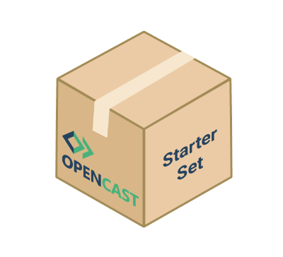

To celebrate Opencast 10th anniversary the Opencast community is giving away five Opencast starter-sets!

We hope that these starter sets will enable instructors, smaller institutes or student initiatives to get an easy start with Opencast and showcase their use case for lecture recording to their institutions. 

A set consist of:

* **An Opencast system for one year on a commercial webhoster.** The server will have 4 CPU cores, 16GB RAM and 480GB Storage. This should be enough for around 150 hours of recordings within this year. It is up to the winner to take over the contract after that time or move the installation to their own data centers.  
* **A hardware capture agent.** This will be an [NCast](https://www.ncast.com/) Presentation Recorder 720 or 1080. The capture agents have been donated by universities that have updated to higher level hardware. They are tested and completly functional. Although these are used devices NCast is providing a 90-day-hardware-warranty for the winners! NCast also still provides free firmware upgrades for these devices. The winners can keep the recorders, even if they stop using Opencast after the trial year.

## [To participate in the drawing fill out this form.](https://goo.gl/forms/1jLKAlXaelX5Lqqd2) 

*The application will end on January 17th 2019. Winners will be announced at the [Opencast Summit 2019 in Zurich (January 16th to 18th 2019)](https://blogs.ethz.ch/opencast2019/).*

We would like to thank the Apereo foundation, NCast, the Friedrich-Alexander-Universität Erlangen-Nürnberg and the Universität Osnabrück for their donations.
